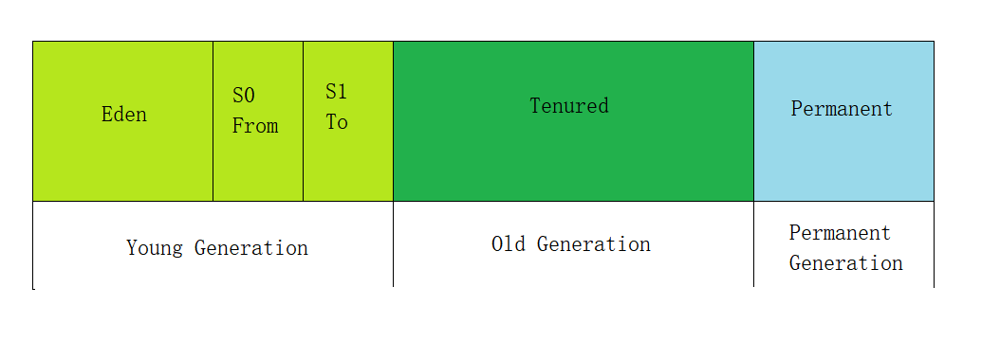

## JVM 虚拟机论述题
### 请你用自己的语言介绍 Java 运行时数据区（内存区域）
JVM 运行时数据区分区如下图所示：

#### 堆、虚拟机栈、本地方法栈、方法区（永久代、元空间）、运行时常量池（字符串常量池）、直接内存
* 堆  
java堆是被所有线程共享的一块内存区域，也是虚拟机管理的内存中占比最大的一块，是垃圾回收的主要发生区域，由虚拟机启动时创建的。堆主要分为两个区域，即新生代和老年代。其中新生代占比 1/3 (分为 Eden 区和两个 Survivor 区，其占比为 8：1：1 )，老年代占比 2/3 。  

* 虚拟机栈  
虚拟机栈是被单个线程独享的一块内存区域，每个Java方法在执行的时候都会创建一个栈帧（Stack Frame）。栈帧中存储了方法的局部变量表、操作数栈、动态来凝结和芳芳返回地址等信息。一个方法从开始到结束的过程就是对应着一个栈帧在虚拟机栈从入栈到出栈的过程。

* 本地方法栈  
本地方法栈是被单个线程独享的一块内存区域，为虚拟机使用到的Native方法（比如C++方法）服务。由于 Java 是一门高级语言，并不直接操作 OS 资源、系统硬件，因此需要通过本地方法调用这些资源。

* 方法区（永久代、元空间）  
方法区是被所有线程共享的一块内存区域,实际上可以理解为一种规范，用于存储类信息、字符串常量池、静态变量、JIT 编译后的代码等数据。方法区的存储位置是由JDK 8 作为分界点的，JDK 8 之前放置在永久代，之后放置到元空间。
> 存储位置不同：永久代所使用的内存区域是JVM进程所使用的区域，受整个JVM的大小所限制；元空间所使用的内存区域是物理内存区域,那么元空间的使用大小只会受物理内存大小的限制。  
> 存储内容不同：永久代存储的信息基本上就是上面方法区存储内容中的数据；元空间只存储类的元信息，而静态变量和运行时常量池迁移到堆中。

* 运行时常量池（字符串常量池）  
运行时常量池在方法区中，是每一个类或者接口的常量池的运行时的表现形式。
字符串常量池简单来说就是专门针对String类型设计的常量池，其使用 HashTable 存放数据， HashTable 的本质是一个数组。

* 直接内存  
直接内存并不是虚拟机运行时数据区的一部分，也不是 Java 虚拟机规范中定义的内存区域。本机直接内存的分配不会受到Java 堆大小的限制，受到本机总内存大小限制，配置虚拟机参数时，不要忽略直接内存防止出现
 OOM 异常。直接内存一般用于生命周期长的数据的存储或者频繁的IO操作。

#### 为什么堆内存要分年轻代和老年代？
划分新生代和老年代的根本原因是为了**提升效率**，其划分原因主要基于弱分代假说和强分代假说。弱分代假说认为：绝大多数对象都是朝生夕灭的。强分代假说认为：熬过越多次垃圾收集过程的对象就越难以消亡。将容易消亡的对象集中放在一起，能以较低代价回收到大量空间。将难以消亡的对象（默认经过15次 GC 仍未被回收则被放置到老年代）集中放在一起，则可以以较低频率回收这些对象。

### 描述一个 Java 对象的生命周期
#### 解释一个对象的创建过程

#### 解释一个对象的内存分配

#### 解释一个对象的销毁过程

#### 对象的 2 种访问方式是什么？
1. 句柄：稳定，对象被移动只要修改句柄中的地址。
2. 直接指针：访问速度快，节省了一次指针定位开销。
> 句柄与普通指针的区别在于，指针包含的是引用对象的内存地址，而句柄则是由系统所管理的引用标识，该标识可以被系统重新定位到一个内存地址上。这种间接访问对象的模式增强了系统对引用对象的控制。

#### 为什么需要内存担保？
当新生代无法分配内存的时候，需要将新生代迁移到老年代，然后才能将新对象放置到新生代。

### 垃圾收集算法有哪些？垃圾收集器有哪些？他们的特点是什么？
#### 垃圾收集算法有哪些？
1. 标记-清除 (Mark-Sweep) 算法 ：如其名称主要分为标记和清除两个步骤。
 * 标记内存中需要回收的区域 (根据垃圾判定方法：引用计数法、可达性分析法)
 
 * 统一回收掉标记出的区域
 
> * 优点： 简单易实现，是最基础的垃圾收集算法。
> * 缺点： 
>   1. 执行效率不稳定。若存在大量需要被回收的对象，那么标记和清除两个步骤都需要因可回收对象的增多而降低执行效率。
> 	2. 产生空间碎片。空间碎片过多可能会需要分配大对象空间时导致无法分配其连续的空间，因此不得不提前触发另一次 GC 。

2. 标记-复制算法：简称复制算法。  
* 将内存一分为二，每次只使用其中一半，另一半作为保留区域，根据对象使用情况分别标记 (根据垃圾判定方法：引用计数法、可达性分析法)

* 将存活的对象复制至原保留区，一次性清空原来的使用区域作为新的保留区域

> * 优点： 实现简单且不会出现空间碎片。
> * 缺点： 空间浪费，可使用的内存缩水一半。

3. 标记-整理 (Mark-Compact) 算法：标记方法与标记清除算法一致，
* 标记内存中需要回收的区域 (根据垃圾判定方法：引用计数法、可达性分析法)

* 将存活的对象统一移动至内存的一端，并且清理掉其他的对象

> * 优点： 不会产生空间碎片。
> * 缺点： 效率较低，移动对象会产生大量开销。

#### 垃圾收集器有哪些？
1. Serial 收集器  
串行收集器，单线程进行垃圾回收。 Serial 作用与新生代的收集器，使用标记-复制算法。

2. Serial Old 收集器   
串行收集器，单线程进行垃圾回收。 Serial Old 作用与老年代的收集器，使用标记-整理算法。

> Serial 和 Serial Old 都属于串行收集器，适用于并行能力弱的机器。串行收集器只有一个线程， GC 时，会暂停其他用户的线程，根据内存分代的不同使用不同的收集器, GC 完成后其他用户线程才会重新运行。  
> 配置参数: **-XX:+UseSerialGC**

3. ParNew 收集器  
并行收集器， Serial 收集器的多线程并行版本。除使用多线程外，与 Serial 相比并无太多变化。单CPU时使用效率并不如 Serial 。 新生代并行使用 ParNew ， 老年代使用 Serial Old。
> 配置参数： 
> 1. **-XX:+UseParNewGC**
> 2. **-XX:ParallelGCThreads=n** 设置并行收集器收集时使用的并行收集线程数。一般最好和计算机的CPU相当。

4. Parallel Scavenge 收集器  
并行收集器，注重**吞吐量优先**的收集器， GC 时需要暂停用户线程。新生代使用并行回收收集器，采用复制算法；老年代使用串行收集器。
> 配置参数： **-XX:+UseParallelGC**

5. Parallel Old 收集器  
并行收集器，Parallel Scavenge 收集器的老年代版本，同样注重吞吐量， GC 时需要暂停用户线程，采用多线程和标记-整理算法。
> 配置参数： **-XX:+UseParallelOldGC**

6. CMS 收集器  
并行收集器，全称**Concurrent Mark Sweep** ，只回收老年代，采用标记-清除算法。当堆内存使用率道道某一阈值即开始回收，并不等待老年代几乎被填满才收集。GC 过程主要分为4个阶段(初始标记、并发标记、重新标记、并发清除)。

> 配置参数： **-XX:+UseConcMarkSweepGC**

7. G1 收集器  
全称 **Garbage-First 收集器**，面向服务端应用的垃圾收集器， 吞吐量和低延迟都可以的**整堆**垃圾收集器。全局使用标记-整理算法，局部采用标记-复制算法。 与之前的收集器相比，G1 取消了新生代和老年代的物理划分，采用若干个固定大小的 Region ，在逻辑上Region 分为 Eden 、Survivor 、 Old 、 Humongous 。GC 过程主要分为4个阶段(初始标记、并发标记、最终标记、筛选回收)。
> 配置参数： **-XX:+UseG1GC**  
> G1最大堆内存是 32MB*2048=64G ，G1最小堆内存 1MB*2048=2GB ，低于此值不建议使用。  
> G1中有三种模式垃圾回收模式： Young GC、Mixed GC 和 Full GC，在不同的条件下被触发。

8. ZGC 收集器  
全程**Z Garbage Collector** ,在 JDK15 中发布稳定版。

> 配置参数： **-XX:+UseZGC**