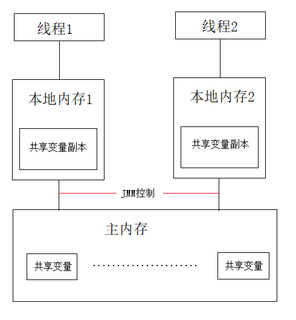
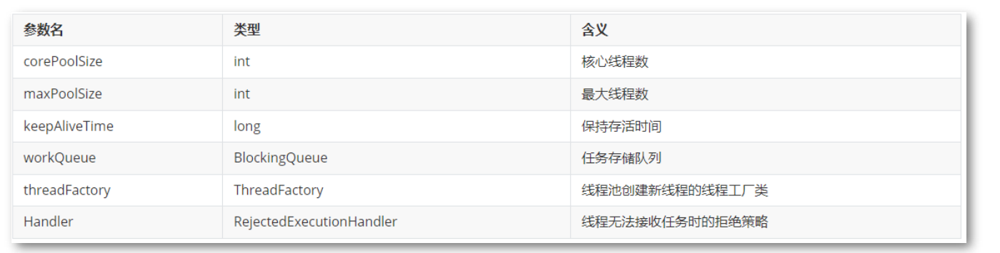

## 并发编程问答题
### 请你说一说什么是线程和进程？
* 定义
1. 进程：是指内存运行的一个应用程序，是系统运行程序的基本单位，是程序的一次执行过程。
2. 线程：是进程中的一个执行单元，负责当前进程中的任务的执行，一个进程会产生很多线程。
* 区别：每个进程都有独立内存空间。线程之间的堆空间和方法区共享，线程栈空间和程序计数器是独立的。
* 关系： 线程是进程的组成部分，一个进程中可以创建很多线程，且至少有一个线程。
* 线程的上下文切换是什么？  
由于一个CPU同一时刻只能被一个线程使用，为了提升效率CPU采用时间片算法将 CPU 时间片轮流分配给多个线程。在分配的时间片内线程执行，如果没有执行完毕则需要挂起然后把CPU让给其他线程。当 CPU 切换线程时，会把当前线程的执行位置记录到程序计数器，用于下次执行时找到准确位置。**线程执行位置的记录与加载过程**被称为**上下文切换**。
* 线程的并发与并行有啥区别？ 
1. 并发(Concurrency)：同一时间段，多个任务都在执行，单位时间内不一定是同时执行。
2. 并行(Parallel)：单位时间内，多个任务同时执行，单位时间内一定是同时执行。
> **并发是一种能力，并行是一种手段**

### 使用了多线程会带来什么问题呢？
* 线程安全问题  
当多个线程同时执行，可能会运行同一行代码，如果程序每次运行结果与单线程执行结果一致且变量的预期值也一样，称之为线程安全的，反之则是线程不安全。如果多个线程对共享变量只有读操作，无写操作，那么此操作是线程安全的。如果多个线程同时执行共享变量的写和读操作，则操作不是线程安全的。
> 1. 出现线程安全性问题的根本原因就是**多个线程共享变量**。如多个售票窗口售卖固定数量的电影票，每个窗口给对电影票的数量是共享的，同一张电影票不能被卖多次。
> 2. 解决线程安全问题方法有：同步机制(Synchronized)、内存屏障(Volatile)、原子类(CAS)、锁(AQS)、并发容器(JUC)

* 原子性、有序性和可见性
1. 原子性: 要么都执行，要么都不执行，执行过程不可打断。
2. 有序性： 代码按照先后顺序执行。
> 指令重排的目的在于**提高程序运行效率**。单线程情况下，遵守***as-if-serial***语义，编译器和处理器不会对存在数据依赖关系的操作做重排序；若操作之间不存在数据依赖关系，则这些操作可能被编译器和处理器重排序，因此保证了代码有序执行。但是多线程情况下的指令重排有可能会导致有序性被破坏。
3. 可见性： 当多个线程访问同一个变量时，一个线程修改了共享变量的值，其他线程能够立即看到。
> JMM (Java Memory Model)决定了一个共享变量何时写入，何时对另一个线程可见，因此会导致共享变量的不可见问题。

### 什么是死锁？如何排查死锁?
* 定义： 在两个或多个并发进程中，如果每个进程持有某种资源而又都等待着别的进程释放它或它们现在保持着的资源，否则就不能向前推进，此时每个进程都占用了一定的资源但又都不能向前推进，称这一组进程产生了死锁。由于资源是有限的，当多个线程各自占用了部分资源且由于完成任务前资源不可被剥夺，因此导致涉及到线程无法完成任务而相互等待，这种现象成为死锁。
* 排查方案
通过jstack查看死锁信息
1. 先通过jps -l 查看进程信息，查到相关的pid  

2. 再执行 jstack -l -${pid} 查看死锁详情。


### 请你说一说 synchronized 和 volatile 的原理与区别
* JMM内存模型: JMM(Java Memory Model)是一组规则和规范，从抽象角度看，JMM定义了线程和主内存之间的抽象关系。JMM决定了一个共享变量何时写入，何时对另一个线程可见。   

> JMM线程操作内存基本规则：
> 1. 线程操作共享变量必须在本地内存中，不能直接操作主内存。
> 2. 线程间无法直接访问对方的共享变量，需经过主内存传递。

* happens-before规则： 在JMM中使用happens-before规则约束编译器优化行为，是一种⽤于保障内存可⻅性的⽅案。Java允许编译器优化，但是不能无条件优化。
1. 程序顺序规则：⼀个线程中的每个操作，happens-before于该线程中的任意后续操作。
2. 监视器锁规则：对⼀个锁的解锁，happens-before于随后对这个锁的加锁。
3. volatile变量规则：对⼀个volatile域的写，happens-before于任意后续对这个volatile域的读。
4. 传递性：如果A happens-before B，且B happens-before C，那么A happens-before C。

* synchronized原理： synchronized 的底层原理是通过 monitorenter 和 monitorexit 这两个 JVM 指令实现的，而这两个指令主要是基于标记字段 MarkWord 和 Monitor（管程）。而管程解决问题的思路就是将共享变量及其对共享变量的操作统一封装起来。
> synchronized 是 Java 关键字，可以用于修饰方法和代码块，以保证该方法和代码块多线程访问共享资源时的安全。该关键字使用方法简单且能保证共享变量的原子性、有序性、可见性。 synchronized 是一种对象锁，是可重入的但不可中断的，是非公平的锁。 相对于其他锁， synchronized 一般被认为是重量级锁。

* volatile原理：通过内存屏障实现共享变量的可见性、有序性。内存屏障（Memory Barrier）是一种CPU指令，用于控制特定条件下的重排序和内存可见性问题。Java编译器会根据内存屏障的规则禁止重排序。Volatile变量写操作时：在写操作后加一条store屏障指令，让本地内存中变量的值能够刷新到主内存。 Volatile变量读操作时：在读操作前加一条load屏障指令，及时读取到变量在主内存的值
> volatile 在某些情况下比锁要更方便。如果一个变量被声明成 volatile，JMM确保所有线程看到这个变量的值是一致的。

* synchronized 和 volatile 区别
1. synchronized 可保证原子性、有序性、可见性；而 volatile 只能保证可见性，无法保证原子性。
2. 相对于 synchronized ， volatile不需要加锁、不会阻塞线程，因此更为轻便。在某种场景下，性能⽐ synchronized 好。

### 为什么使用线程池？如何创建线程池？
* 为什么使用线程池？
线程池（ThreadPool） 是一种基于**池化思想**管理线程的工具。线程池维护多个线程，等待监督和管理分配可并发执行的任务。创建线程是一种消耗很大的行为，频繁创建线程会降低系统整体性能。因此使用线程池可以有效减少重复创建线程而产生的消耗。
1. 降低资源消耗：通过线程池复用线程，降低创建线程和释放线程的损耗。
2. 提高响应速度：任务到达时，无需等待即刻运行。
3. 提高线程的可管理性：使用线程池可以进行统一的分配、调优和监控线程。
4. 提供可扩展性：线程池具备可扩展性，研发人员可以向其中增加各种功能，比如延时，定时，监控等。

* 自动创建线程池：Java通过Executors工厂类提供四种线程池
1. newFixedThreadPool：固定数量线程池，无界任务阻塞队列。
2. newSingleThreadExecutor ：一个线程的线程池，无界任务阻塞队列。
3. newCachedThreadPool ：可缓存线程的无界线程池，可以自动回收多余线程。
4. newScheduledThreadPool ：定时任务线程池。
```java
// 固定数量线程池
ExecutorService threadPool1 = Executors.newFixedThreadPool(5);
// 单线程池
ExecutorService threadPool2 = Executors.newSingleThreadExecutor();
// 可缓存线程池
ExecutorService threadPool3 = Executors.newCachedThreadPool();
// 定时任务线程池
ScheduledExecutorService threadPool4 = Executors.newScheduledThreadPool(10);
```
* 手动创建线程池  
```java
// 使用标准构造器，构造一个普通的线程池
public ThreadPoolExecutor(
    int corePoolSize, // 核心线程数，即使线程空闲（Idle），也不会回收；
    int maximumPoolSize, // 线程数的上限；
    long keepAliveTime, TimeUnit unit, // 线程最大空闲（Idle）时长
    BlockingQueue workQueue, // 任务的排队队列
    ThreadFactory threadFactory, // 新线程的产生方式
	RejectedExecutionHandler handler// 拒绝策略) 
```

> 1. CPU 密集型任务的并⾏执⾏的数量应当等于 CPU 的核⼼数
> 2. I/O 密集型任务通常需要开 CPU 核⼼数两倍的线程
> 3. 拒绝策略：AbortPolicy 、DiscardPolicy、DiscardOldestPolicy、CallerRunsPolicy
 
* 线程池的实现原理
1. 如果线程数小于 corePoolSize，即使其它工作线程处于空闲状态，也会创建一个新线程来运行新任务。
2. 如果线程数大于等于 corePoolSize，但少于 maxPoolSize，将任务放入队列。
3. 如果队列已满，并且线程数小于 maxPoolSize，则创建一个新线程来运行任务。
4. 如果队列已满，并且线程数大于或等于 maxPoolSize，则拒绝该任务。


### ThreadLocal中Map的key为什么要使用弱引用？
* ThreadLocal 定义  
ThreadLocal 是线程本地变量类，在多线程并执行过程中，将变量存储在 ThreadLocal 中，每个线程中都有独立的变量，因
此不会出现线程安全问题。
* 阿里Java开发手册中，为什么说不清理自定义的 ThreadLocal 变量会导致内存泄露呢？
1. 每个 Thread 都会存在一个 ThreadLocal ,其内部存在一个 ThreadLocalMap 。 Map是一种 key-value 结构，ThreadLocalMap 的 key 是其 ThreadLocal 实例。
2. ThreadLocal内存泄漏的根源是：由于 ThreadLocalMap 的生命周期跟 Thread 一样长，如果没有手动删除对应 key 就会导致内存泄漏。
3. 采用弱引用 ThreadLocal 不会内存泄漏，对应的 value 在下一次 ThreadLocalMap 调用 set/get/remove 的时候会被清除。
