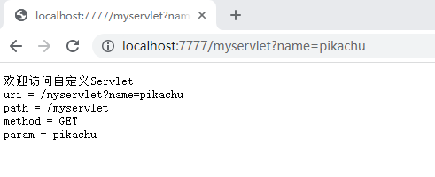
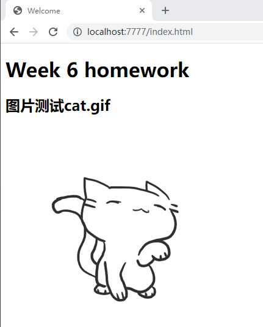
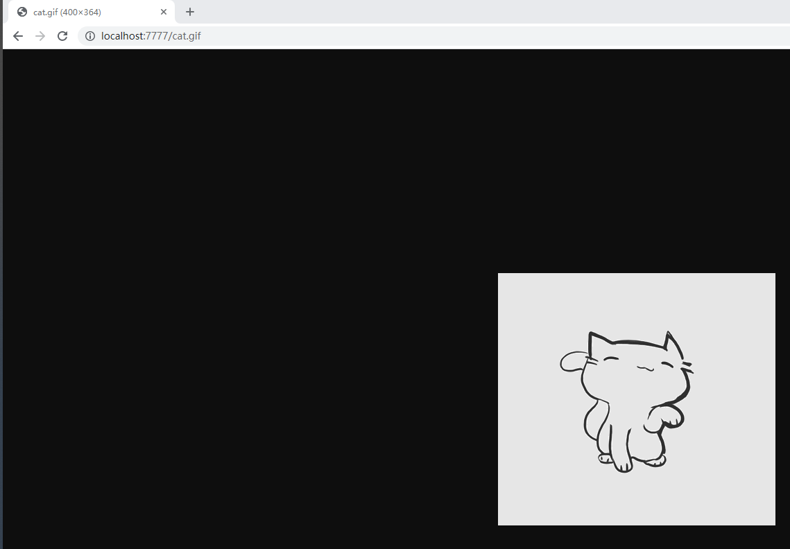

## 网络编程实践题
simple-cat 项目为自定义Web容器，simple-cat-test 为测试项目。
### simple-cat-test 使用 simple-cat 步骤
1. 添加 pom 依赖
```xml
<dependencies>
    <dependency>
        <groupId>com.wang.simplecat</groupId>
        <artifactId>simple-cat</artifactId>
        <version>1.0-SNAPSHOT</version>
    </dependency>
</dependencies>
```
2. 通过 server.xml 文件配置自端口号和自定义 Servlet 指定包
 ```xml
<?xml version="1.0" encoding="UTF-8" ?>
<server>
    <port>7777</port>
    <base-package>com.wang.simplecat.webapp</base-package>
</server>
```
3. 自定义servlet  
测试项目中共实现了定义 2 个自定义 servlet : MyServlet 、MyServlet2

4. 启动服务 ： 通过 MyApplication.java 启动容器
```java
public class MyApplication {
    public static void main(String[] args) throws Exception {
        SimpleCat.run(args);
    }
}
```
5. 测试结果 
* MyServlet ： 课程演示自定义Servlet，浏览器访问 http://localhost:7777/myservlet?name=pikachu ，结果如下图

* MyServlet2 : 展示全部参数， 浏览器访问 http://localhost:7777/myservlet?username=admin&pwd=123456 ,结果如下图

* 访问静态资源 : http://localhost:7777/index ,展示默认 index.html 页面，结果如下图  
  
也可指定静态资源文件名访问， 浏览器访问 http://localhost:7777/index.html ,结果如下图  
  
访问默认文件 cat.gif ,浏览器访问 http://localhost:7777/cat.gif  ,结果如下图
  
访问不存在的静态资源文件， http://localhost:7777/cat.png ，结果如下图  
  
