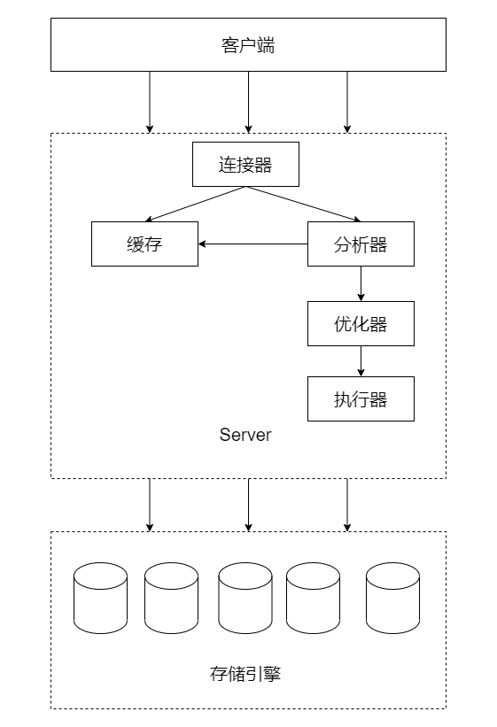

## 数据库问答题
### 题目 01- 一条 SQL 语句在 MySQL 中是如何执行的？
MySQL 可以分为 Server 层和存储引擎层两部分。其中 Server 层包括连接器、缓存、分析器、优化器、执行器。 MySQL 逻辑架构如下图所示：   
  
根据逻辑架构图可知，执行一条 SQL 语句时，会经历如下流程：
1. 通过连接器跟客户端建立连接、获取权限、维持和管理连接。
2. 查询缓存，若命中结果则返回结果，否则进行下一步。由于当表数据更新时，缓存就会失效，表内所有的查询缓存都会被清空，因此不推荐使用 MySQL 自带的缓存，并且 MySQL 8.0 版本已取消了该功能。
3. 分析 SQL 语句，通过分析器对 SQL 语句进行词法分析、语法分析和预处理器等。
* 词法分析用于识别出 SQL 语句分别代表了什么。
* 语法分析用于校验 SQL 语句是否符合 MySQL 语法，若不符合则报错。
* 预处理器则会进一步去检查解析树是否合法，比如表名是否存在、语句中表的列是否存在等，并且会校验用户是否有表的操作权限。
4. 对查询进行优化，作用是根据解析树生成不同的执行计划，然后选择最优的执行计划。
5. 执行 SQL 语句，执行器会操作存储引擎返回 SQL 执行结果。
### 题目 02- 请解释一下你理解的事务是什么？
1. 定义：事务指的是逻辑上的一组操作，这组操作的组成单元要么全都成功，要么全都失败，其本质是并发编程问题。
2. 事务四大特性 ACID
*  原子性 (Atomicity)：事务是最小的工作单元，对事务的操作要么全成功，要么全失败。
*  一致性 (Consistency)：事务前后数据的完整性必须保持一致。
*	 隔离性 (Isolation)：多个用户并发使用数据库时，彼此事务操作数据不能互相干扰，多个并发事务之间要相互隔离。
*  持久性 (Durability)：事务一旦提交，其对数据的改变是永久性的，即便数据库出现故障也不可更改事务对数据已产生的变化。 
3. 事务隔离级别
* 读未提交 (Read Uncommitted, 简称 RU): 一个事务读到另一个事务没有提交的数据。此隔离级别有可能引发脏读、不可重复读、幻读问题。
*  读已提交 (Read Committed,简称 RC): 一个事务读到另一个事务已经提交的数据。此隔离级别有可能引发不可重复读、幻读问题。  
* 可重复读 (Repeatable Read,简称 RR): 在一个事务中读到的数据始终保持一致，无论另一个事务是否提交。此隔离级别有可能引发幻读问题。这也是 MySQL InnoDB 引擎的默认隔离级别。
*  串行化读 (Serializable): 同时只能执行一个事务，相当于事务中的单线程。因此不会引发并发问题。
4. 事务会产生的并发问题
* 脏读：一个事务读到了另一个事务**未提交**的数据。  
如数据库表有一条姓名为“张三”的数据，事务 A 将其更改为“李四”，但并未提交事务。此时事务 B 却读到“李四”这个结果，对事务 B 而言，“李四”是条脏数据，因此称为“脏读”。  
* 不可重复读：一个事务读到另一个事务**已经更新**的数据，导致事务中的多次查询结果不一致。  
如数据库表有一条姓名为“张三”的数据，事务 B 读取的结果也是“张三”， 此时事务 A 将其更改为“李四”并提交事务。事务 B 再次读取同一条时读到“李四”这个结果。对事务 B 而言，一次事务过程中，读取同一条数据的结果是不一致的。
* 幻读/虚读：一个事务读到另一个事务**已经新增**的数据，导致事务中多次查询的结果不一致。  
如数据库表中存在 10 条数据，事务 A 查询数据总量得到 10 条记录的结果，此时事务 B 新增了 1 条数据并提交了事务， 事务 A 再次查询数据总量时， 发现有 11 条记录。对事务 A 而言，前后查询的结果不一致仿佛产生幻觉，因此称为“幻读”。
> 不可重复读和幻读的区别： 不可重复读是由于另一个事务对数据的**更改**所造成的，而幻读是由于另一个事务**插入或删除**引起的。
5. 事务的安全性、性能与隔离级别的关系
* 安全性： serializable > repeatable read > read committed > read uncommitted
* 性能：  serializable < repeatable read < read committed < read uncommitted
