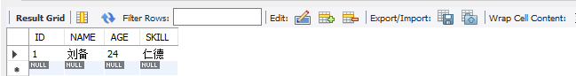
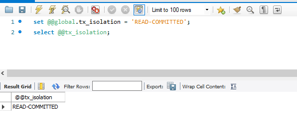
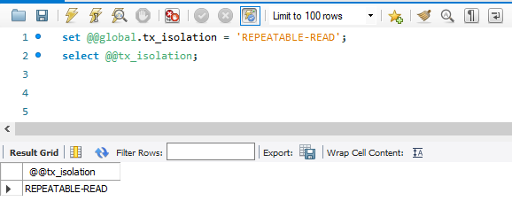
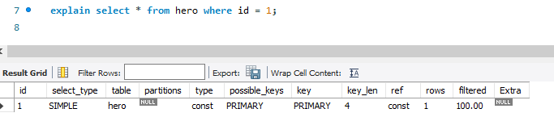
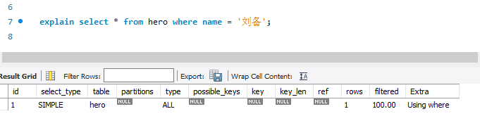
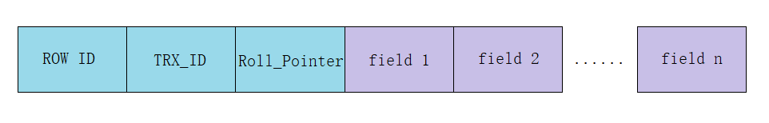

## 数据库问答题
### 题目 01- 完成 ReadView 案例，解释为什么 RR 和 RC 隔离级别下看到查询结果不一致
为了更直观的对比 RC 隔离级别和 RR 隔离级别可见性，采用相同的数据库、数据库表及相同的操作步骤进行对比实验。  
数据库表结构如下：
```sql
CREATE TABLE `hero` (
  `ID` int(11) NOT NULL AUTO_INCREMENT,
  `NAME` varchar(64) NOT NULL,
  `AGE` int(11) DEFAULT NULL,
  `SKILL` varchar(128) DEFAULT NULL,
  PRIMARY KEY (`ID`)
) ENGINE=InnoDB DEFAULT CHARSET=utf8mb4;
```
表中数据如下：  
 

#### 案例 01- 读已提交 RC 隔离级别下的可见性分析
1. 目标：验证读已提交 RC 隔离级别下的数据可见性。
2. 操作步骤
* 设置隔离级别为 RC 并确认是否设置成功
```sql
-- 设置隔离级别为 RC
set @@global.tx_isolation = 'READ-COMMITTED';
-- 查询是否设置成功
select @@tx_isolation;
```

* 同时开启两个事务，事务 A 用于更改数据，事务 B 用于查询数据。两个事务交替执行
```sql
# 事务 A
begin; # T1
update hero set `name` = '关羽' where id = 1; # T3
update hero set `name` = '张飞' where id = 1; # T5
commit; # T7
# 事务 B
begin; # T1
select `name` from hero where id = 1; # T2
select `name` from hero where id = 1; # T4
select `name` from hero where id = 1; # T6
select `name` from hero where id = 1; # T8
commit; # T9
```
* 记录两个事务执行过程及结果
3. 实践过程

| 时序 |事务 A  |事务 B  |
| --- | --- | --- |
| T1 | begin; |begin;  |
| T2 |  |select `name` from hero where id = 1;  <br> name ='刘备'  |
| T3 |update hero set `name` = '关羽' where id = 1;  |  |
| T4 |  |select `name` from hero where id = 1;  <br> name ='刘备'  |
| T5 |update hero set `name` = '张飞' where id = 1;  |  |
| T6 |  |select `name` from hero where id = 1;  <br> name ='刘备'   |
| T7 |commit;  |  |
| T8 |  |select `name` from hero where id = 1; <br> name ='张飞' |
| T9 |  |commit;  |
4. 结论  
事务 A 提交前，事务 B 查询到的结果都是事务 B 开启前的结果“刘备”；当事务 A 提交后，事务 B 查询到的姓名结果为事务 A 最后更新的结果“张飞”。在 RC 隔离级别，在事务每一次查询时生成 ReadView，因此事务 B 的查询结果会受到其他事务的影响。
#### 案例 02- 可重复读 RR 隔离级别下的可见性分析
1. 目标： 验证可重复 RR 隔离级别下的数据可见性。
2. 操作步骤
* 设置隔离级别为 RR 并确认是否设置成功
```sql
-- 设置隔离级别为 RR
set @@global.tx_isolation = 'REPEATABLE-READ';
-- 查询是否设置成功
select @@tx_isolation;
```

* 同时开启两个事务，事务 A 用于更改数据，事务 B 用于查询数据。两个事务交替执行
```sql
# 事务 A
begin; # T1
update hero set `name` = '关羽' where id = 1; # T3
update hero set `name` = '张飞' where id = 1; # T5
commit; # T7
# 事务 B
begin; # T1
select `name` from hero where id = 1; # T2
select `name` from hero where id = 1; # T4
select `name` from hero where id = 1; # T6
select `name` from hero where id = 1; # T8
commit; # T9
```
* 记录两个事务执行过程及结果
3. 实践过程

| 时序 |事务 A  |事务 B  |
| --- | --- | --- |
| T1 | begin; |begin;  |
| T2 |  |select `name` from hero where id = 1;  <br> name ='刘备'  |
| T3 |update hero set `name` = '关羽' where id = 1;  |  |
| T4 |  |select `name` from hero where id = 1;  <br> name ='刘备'  |
| T5 |update hero set `name` = '张飞' where id = 1;  |  |
| T6 |  |select `name` from hero where id = 1;  <br> name ='刘备'   |
| T7 |commit;  |  |
| T8 |  |select `name` from hero where id = 1; <br> name ='刘备' |
| T9 |  |commit;  |
4. 结论  
   事务 B 查询的姓名结果不受事务 A 提交的影响，始终是事务 B 开启前的结果“刘备”。在 RC 隔离级别下，事务在每
次查询开始时都会生成一个独立的 ReadView，因此事务 B 的查询结果是一致的。
### 题目 02- 什么是索引？
1. 定义： 索引是数据库**高效获取数据**的**数据结构**。其作用在于加快查询速度，索引一般存储在表空间中，也就是磁盘里。现实中的新华字典就通过索引页引导读者根据汉语拼音音节快速找到目标文字的大概位置，读者可根据这个位置再行查找目标，通过索引读者不需要翻遍整本字典大海捞针。  
2. 优点: **两升一降**
* 降低磁盘IO频次
* 降低数据排序的成本
* 提高数据检索效率
> 1. 被索引列会自动排序【B+树叶子节点的有序特性】
> 2. 如果Order By的字段使用索引，效率会高特别多
3. 缺点：
* 占用更多磁盘空间（空间换时间）
* 降低更新效率
4. 索引分类和特点  
按照索引构成数量来看，索引可分为**单列索引**和**组合索引**。
* 单列索引：索引中只有一个列。
> 单列索引包含以下类型：
> 1. 主键索引：索引列必须唯一且非空。
> 2. 唯一性索引：索引列值必须唯一且可以为 Null 。
> 3. 普通索引：索引列值可以不唯一，也可以为空 Null 。
> 4. 全文索引：支持全文搜索的索引，只能对文本类型字段设置。由于效率问题不建议使用，可以使用更专业的方案实现。
> 5. 空间索引：5.7 版支持空间索引，而且支持 OpenGIS 几何数据模型。
> 6. 前缀索引：用索引列字段的一部分建立索引。
* 组合索引： 索引中含有两个列以上。
5. 索引创建原则
* 频繁出现在 where 条件，order 排序，group by 的字段
* select 频繁查询的列
* 多表 join 关联查询 on 两边的字段
* 表记录很少不需要创建索引
*  单表索引的个数不能太多，尤其是单列索引。每个索引都是一棵索引树，会占据一定的磁盘空间。每次更新都需要更新索引树，造成开销。另外索引过多会增加优化器的选择时间。
* 频繁更新的资源，不建议作为索引：频繁更新的字段引发频繁的页分裂和页合并，性能消耗比较高。
* 区分度不高的字段，不建议作为索引：如：性别，布尔，状态等。区分度太低索引会导致扫描行数过多，再加上回表查询的消耗，比全表扫描的性能还要差。此类字段一般会用在组合索引中。
* 无序的字段，不建议作为索引：如：身份证，UUID等。更新数据时，会出现频繁的页分裂，页内数据不紧凑浪费存储空间。
* 主键索引建议使用自增的长整型，避免使用很长的字段：主键字段越长，索引页和辅助索引的叶子节点可存储的数据量就越少，查询时磁盘IO次数会增多，降低查询效率。
* 尽量创建组合索引，而不是单列索引。
6. 如何判断 SQL 是否用到索引
使用执行计划：
```sql
-- 根据主键索引查询
explain select * from hero where id = 1;
```

```sql
-- 查询非索引字段
explain select * from hero where name = '刘备';
```
  

7. 索引的原理是什么？说清楚为什么要用B+Tree  
索引是一种利用某种规则的数据结构与实际数据的关系加快数据查找的数据结构，其原理与通过书的目录快速定位类似。  
索引有多种实现方案：如 Hash 、有序数组、二叉搜索树、红黑树、B 树、B+ 树等。其中，Hash 适用于只有等值查询的场景；有序数组在等值查询和范围查询场景中的性能就都非常优秀,但是只适用于静态存储引擎，即保存后轻易不再修改的数据。因此 Hash 和有序数据不能满足 MySQL 的索引使用场景，以树作为索引实现方案成为了选择。  
二叉搜索树每个节点最多有2个分叉，左子树和右子树数据顺序左小右大，理想状态下效率可以达到O(logn)。但是极端情况下，二叉查找树会构建成为单向链表，此时通过二叉搜索树做索引搜索将退化为全表扫描。
红黑树是一个近似平衡的二叉树，其时间复杂度是 O(log2n)。但是平衡二叉树存在的问题：
* 时间复杂度和树高相关：树有多高就需要检索多少次，每个节点的读取，都对应一次磁盘 IO 操作瓶颈。磁盘每次寻道时间为10ms，在表数据量大时，对响应时间要求高的场景下，查询性能就会出现瓶颈。  
> 1百万的数据量，log2n约等于20次磁盘IO，时间20*10=0.2s
* 平衡二叉树不支持范围查询快速查找，范围查询时需要从根节点多次遍历，查询效率极差。
* 数据量大的情况下，索引存储空间占用巨大。而且每次更新，红黑树都要经历复杂的平衡过程，开销也很可观。

为了减少耗时的IO操作，就要尽量降低树的高度。每个节点存储多个元素，在每个节点尽可能多的存储数据，因此就将二叉树改造成了多叉树，通过增加树的叉树，将树从高瘦变为矮胖。而 B 树刚好是一种于多叉树又名平衡多路查找树。选择 B 树的优点：磁盘IO次数会大大减少；比较是在内存中进行的，比较的耗时可以忽略不计；B 树的高度一般2至3层就能满足大部分的应用场景，所以使用B树构建索引可以很好的提升查询的效率。但是与此同时B树不支持范围查询的快速查找且空间占用较大。因此 MySQL 在 B 树的基础上继续改造，使用 B+ 树构建索引。B+ 树和 B 树最主要的区别在于**非叶子节点**是否存储数据的问题。继承了B树的优点并且保证等值和范围查询的快速查找。B+树只有叶子节点才会存储数据，非叶子节点只存储键值;叶子节点之间使用双向指针连接，最底层的叶子节点形成了一个双向有序链表。对比各种数据结构综合考量，使用 B+ 树作为索引在执行时间方面，查询数据的时间比较短；在存储空间方面，消耗的内存空间和磁盘空间也是比较少的。  
> MySQL中InnoDB页的大小默认是16k。指针在InnoDB中为6字节，设主键的类型是bigint，占8字节。一组就是14字节。
一个非叶子结点可以存储16 * 1024 / 14 = 1170个索引指针。假设一条数据的大小是1KB，那么一个叶子结点可以存储16条数据。两层 B+ 树可以存储1170 x 16 = 18720 条数据。三层 B+ 树可以存储1170 x 1170 x 16 = 21902400条数据。  

B+ 树结构如下图所示：

等值查询时从根节点出发，比较目标值与树节点值大小，若目标值小于树节点值，则选取其左侧的指针查找下级节点；目标值大于树节点值则向右查找下级节点。以此类推，直至找到搜索到叶子节点为止。  
范围查询时从根节点出发，以左范围值作为目标值，比较目标值与树节点值大小，若目标值小于树节点值，则选取其左侧的指针查找下级节点；目标值大于树节点值则向右查找下级节点。以此类推，直至找到叶子节点为止。找到左范围值节点后，则根据叶子节点间的双向链表找到右边界值为止。
### 题目 03- 什么是 MVCC？
1. 定义： MVCC (Multi-Version Concurrency Control, 多版本并发控制) 是 RDBMS 常用的一种并发控制方法，用来对数据库数据进行并发访问，实现事务。其核心思想是**读不加锁，读写不冲突**。实现原理是通过对修改的数据做快照(记录到 Undo log)，不同事务访问数据快照中不同版本的数据。MVCC 主要实现部分包括 Undo 日志和 ReadView 。
> MVCC 通过保存数据的快照，根据比较数据的版本号来决定数据的是否显示，以此实现在在不需要加读锁的情况就能达到事务的隔离效果。最终可以在读取数据的时候可以同时进行修改，修改数据时候可以同时读取。
2. Undo 日志
在对数据修改时，InnoDB 会产生一定量的 Undo 日志。如果事务执行失败，则利用Undo日志回滚到历史版本。Undo日志还可以解决丢失更新问题。  
Undo 日志根据操作的不同分为两种类型：
* Insert Undo 日志：是在Insert操作中产生的Undo日志
* Update Undo日志：是Update或Delete 操作中产生的Undo日志  
Undo 日志结构如下图所示：  

* ROW ID: 隐藏 ID ，若表结构创建时未指定主键，则该字段作为隐藏主键创建聚簇索引。
* TRX_ID：记录操作该数据事务的事务 ID 。
* Roll_Pointer： 回滚指针，指向上一个版本数据在 Undo 日志里的位置指针。
* fileds: 数据库表用户可见字段
3. ReadView  
ReadView 是张存储事务 id 的列表，主要包含当前系统中有哪些活跃的读写事务 id ，结合Undo日志的默认字段 **TRX_ID** 来控制那个版本的Undo日志可被其他事务看见。RR 和 RC 隔离级别的不同在于 ReadView 的生成时机的不同。RC 隔离级别，在事务每一次查询时生成 ReadView ；RR 隔离级别，仅在事务第一次查询时生成 ReadView 。  
ReadView 主要由以下部分组成：
* m_ids：生成ReadView时，当前活跃的事务id列表
* m_low_limit_id：事务id下限，当前活跃事务中最小的事务id
* m_up_limit_id：事务id上限，生成ReadView时，应该分配给下一个事务的id值
* m_creator_trx_id：生成该ReadView的事务的事务id
4. 可见性判断
根据 Undo 日志和 ReadView 配合判断可见性，规则如下：
* TRX_ID 小于 m_low_limit_id，可以被当前事务访问
* TRX_ID 等于 m_create_trx_id，可以被当前事务访问
* TRX_ID 大于 m_up_limit_id，不可以被当前事务访问
* TRX_ID 在low和up的limit之间，则需要判断是否在m_ids里面。如果在，则不可以访问；如果不在，则可以访问。

